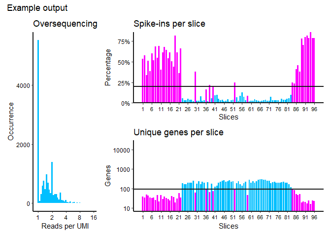

<!-- badges: start -->

[](https://github.com/erikschild/TomoQC/actions)
<!-- badges: end -->

# TomoQC

A quick quality check for tomosequencing data

## Overview

The goal of TomoQC is to provide a quick, simple quality control to
assess the quality of a tomosequencing sample. Read, UMI, and Transcript
count tables are required for the function to run. Note: if using
CelSeq2 primers, first select the 96 columns used out of the 384 CelSeq2
primers. The function can only run on data with 96 columns.

## Installation

TomoQC is available to install from github:

``` r
# install.packages("devtools")
devtools::install_github("erikschild/TomoQC")
```

## Example

The package includes a 1000 gene dummy dataset which gives an idea of
how output may look. Note that in a real experiment, the data input
would be based on many more genes.

### Oversequencing

Plots a histogram of UMIs/reads per gene. Any occurrence of a value \>1
indicates multiple reads originating from the same RNA molecule. The
further the peak of the histogram shifts to the right, the more
saturated sequencing depth is.

### Spike-ins

Plots the percentage of all reads in a column mapping to ERCC spike-ins.
A high percentage likely means no sample was present, and vice versa
(lower = better).

### Unique genes

The amount of unique mapped genes per column. More unique genes are
expected to map where sample was present (higher = better).

``` r
library(TomoQC)
example <- tomo_quality(transcripts = example_data$transcripts,
                        reads = example_data$reads,
                        umis = example_data$UMIs,
                        cutoff_spike = 20,
                        cutoff_genes = 90,
                        plot_title = "Example output")
```

<!-- -->

``` r
example
#> # A tibble: 96 x 4
#>    Slice Genes Spike_ins_percentage Wormslice
#>    <dbl> <dbl>                <dbl> <chr>    
#>  1     1    38                 53.7 not_worm 
#>  2     2    34                 57.8 not_worm 
#>  3     3    49                 33.5 not_worm 
#>  4     4    43                 51.0 not_worm 
#>  5     5    34                 38.8 not_worm 
#>  6     6    33                 60.4 not_worm 
#>  7     7    34                 51.8 not_worm 
#>  8     8    25                 68.4 not_worm 
#>  9     9    47                 54.7 not_worm 
#> 10    10    22                 69.1 not_worm 
#> # ... with 86 more rows
```
