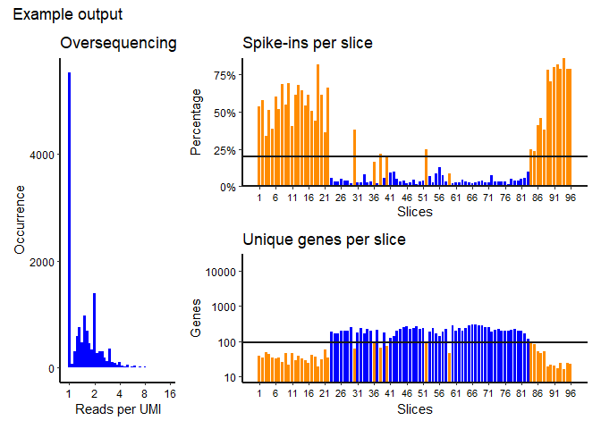

TomoQC
================
Erik Schild

# TomoQC

Tomosequencing QC function \# Overview The goal of TomoQC is to provide
a quick, simple quality control to assess the quality of a
tomosequencing sample. Read, UMI , and Transcript count tables are
required for the function to run. \#Installation TomoQC is available to
install from github:

``` r
  # install.packages("devtools")
  devtools::install_github("thomasp85/patchwork")
```

# Example

The package includes a 1000 gene dummy dataset which gives an idea of
how output may look. Note that in a real experiment, the data input
would be based on many more genes

``` r
library(TomoQC)
  tomo_quality(example_data$ex_transcripts, example_data$ex_reads, example_data$ex_barcodes, cutoff_spike = 0.2, cutoff_genes = 90, plot_title = "Example output")
```

<!-- -->

    #> # A tibble: 96 x 4
    #>    slices genes fraction Wormslice
    #>     <dbl> <dbl>    <dbl> <chr>    
    #>  1      1    38    0.537 not_worm 
    #>  2      2    34    0.578 not_worm 
    #>  3      3    49    0.335 not_worm 
    #>  4      4    43    0.510 not_worm 
    #>  5      5    34    0.388 not_worm 
    #>  6      6    33    0.604 not_worm 
    #>  7      7    34    0.518 not_worm 
    #>  8      8    25    0.684 not_worm 
    #>  9      9    47    0.547 not_worm 
    #> 10     10    22    0.691 not_worm 
    #> # ... with 86 more rows
